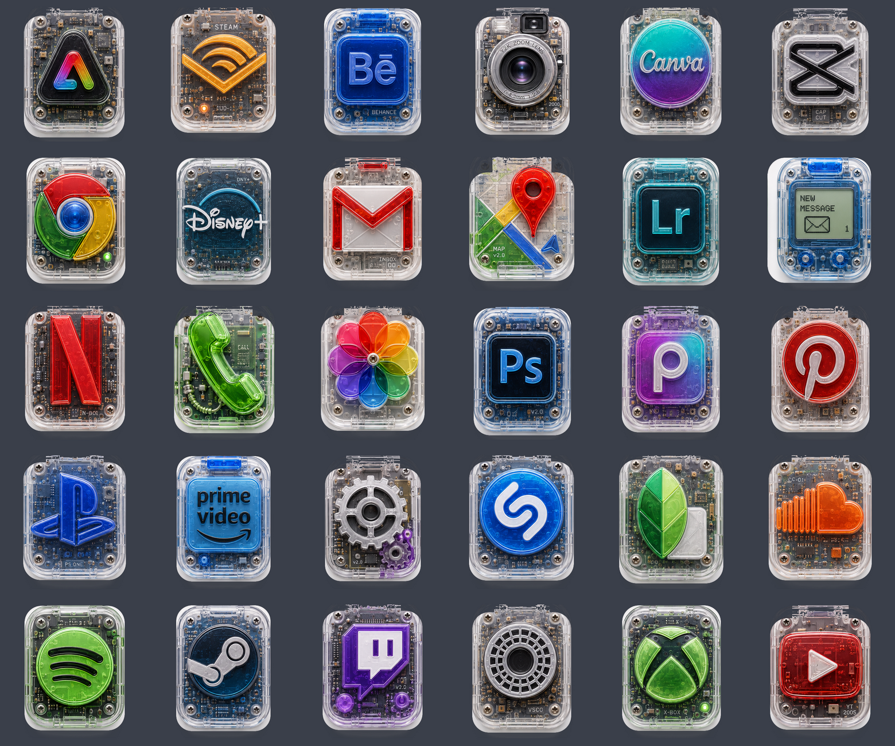

# Y2K Circuit Icons — Android Icon Pack

A 30-icon Android theme pack in a transparent Y2K-hardware style: every app icon
looks like a clear-plastic gadget with visible circuit boards and screws.

## What's inside

| Category | Icons |
|---|---|
| System | Phone, Messages, Camera, Photos, Settings, Chrome, Gmail, Google Maps, YouTube, Spotify |
| Creative | Photoshop, Lightroom, Canva, CapCut, Snapseed, VSCO, Picsart, Pinterest, Behance, Adobe Express |
| Entertainment | Netflix, Prime Video, Disney+, Twitch, Steam, Xbox, PlayStation, SoundCloud, Shazam, Audible |

## Install (phone only, no computer)

1. On your phone, download **`Y2KCircuit-IconPack.apk`** from this folder
   (tap the file on GitHub, then tap the download icon / "Raw").
2. Open the downloaded file. If prompted, allow your browser to
   *install unknown apps* (Settings → Apps → your browser → Install unknown apps).
3. Tap **Install**.

## Apply

Icon packs need a launcher that supports them (the stock Pixel launcher doesn't):

- **Nova Launcher** — Nova Settings → Look & feel → Icon style → Icon theme → *Y2K Circuit Icons*
- **Lawnchair** — Home settings → General → Icon pack → *Y2K Circuit Icons*
- **Smart Launcher** — Settings → Global appearance → Icon pack
- **Samsung (One UI)** — install *Good Lock → Theme Park*, create a theme from an icon pack, pick *Y2K Circuit Icons*

Apps not covered by the pack keep their normal icons. In most launchers you can
also long-press any app → Edit → tap its icon to hand-pick one of the 30 icons.

## Rebuild from source

`build.sh` builds the APK with `aapt`, `zipalign`, and `apksigner`
(Ubuntu: `apt install aapt zipalign apksigner`), using an `android.jar`
framework stub from Maven Central. Icon sources are the 512×512 PNGs in
`res/drawable-nodpi/`, mappings in `assets/appfilter.xml`.
